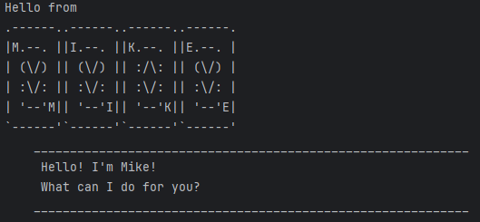

# Mike User Guide



Mike is a CLI-based interactive chatbot that helps users organize and manage tasks 
efficiently. It supports adding, marking, unmarking, deleting, and 
finding tasks while maintaining data(tasks) persistence.

## Adding todos : `todo`

Adds a todo task in the user current list of tasks.

Format: `todo TODO_TASK`

Example: `todo Jogging`

```
    ____________________________________________________________
     Got it. I've added this task:
     [T][ ] Jogging
     Now you have 1 task in the list.
    ____________________________________________________________
```

## Adding deadlines : `deadline`

Adds a deadline task in the user current list of tasks.

Format: `deadline DEADLINE_TASK /by DATE`

Example: `deadline Homework /by 25 Feb`

```
    ____________________________________________________________
     Got it. I've added this task:
     [D][ ] Homework (by: 25 Feb)
     Now you have 2 task in the list.
    ____________________________________________________________
```

## Adding events : `event`

Adds an event task in the user current list of tasks.

Format: `event EVENT_TASK /from START_DATE /to END_DATE`

Example: `event CNY /from 1st Jan /to 3rd Jan` 

```
    ____________________________________________________________
     Got it. I've added this task:
     [E][ ] CNY (from: 1st Jan to: 3rd Jan)
     Now you have 3 task in the list.
    ____________________________________________________________
```

## Listing tasks : `list`

Lists all the tasks of the user.

Format: `list`

Example: `list`

```
    ____________________________________________________________
     Here are the tasks in your list:
     1.[T][ ] Jogging
     2.[D][ ] Homework (by: 25 Feb)
     3.[E][ ] CNY (from: 1st Jan to: 3rd Jan)
    ____________________________________________________________
```

## Delete task : `delete`

Delete a task from the user current list of tasks.

Format: `delete INDEX`

Example: `delete 2`

```
    ____________________________________________________________
     OK, I've removed this task:
     [D][ ] Homework (by: 25 Feb)
     Now you have 2 task in the list.
    ____________________________________________________________
```

## Mark task as done : `mark`

Mark a task as done from the user current list of tasks.

Format: `mark INDEX`

Example: `mark 1`

```
    ____________________________________________________________
     Nice! I've marked this task as done:
     [T][X] Jogging
    ____________________________________________________________
```

## Unmark task as done : `unmark`

Unmark a task as done from the user current list of tasks.

Format: `unmark INDEX`

Example: `unmark 1`

```
    ____________________________________________________________
     OK, I've unmarked this task as done:
     [T][ ] Jogging
    ____________________________________________________________
```

## Locate a certain task by its description : `find`

Find task(s) in the user current list by searching for a keyword in the task description

Format: `find KEYWORD`

Example: `find book`

```
    ____________________________________________________________
     Here are the tasks in your list:
     1.[T][ ] read the book on CS2113
     2.[D][ ] complete exercise book (by: 09 Mar)
    ____________________________________________________________
```

## Exiting the program : `bye`

Exits the program Mike.

Format: `bye`

Example: `bye`

```
    ____________________________________________________________
     Bye. Hope to see you again soon!
    ____________________________________________________________

```